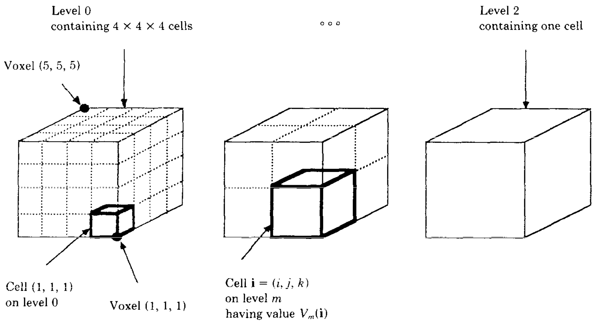
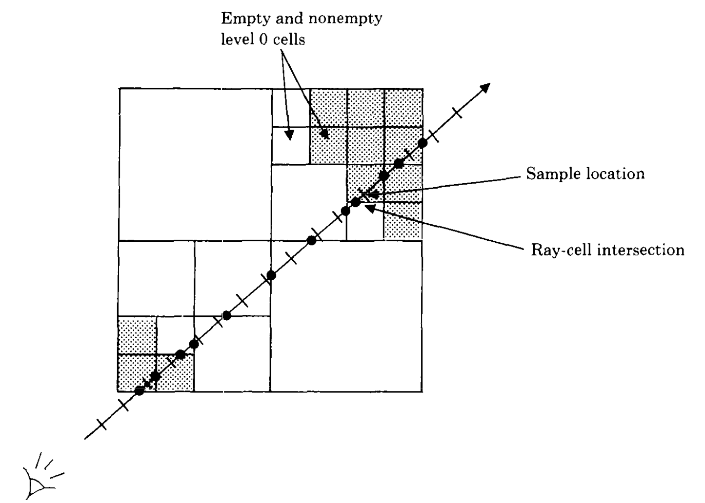

# Unity CTVisualizer

<!--toc:start-->
- [Unity CTVisualizer](#unity-ctvisualizer)
  - [Workflow](#workflow)
  - [Installation](#installation)
  - [Usage](#usage)
  - [Performance Statistics](#performance-statistics)
  - [Limitations](#limitations)
  - [License](#license)
<!--toc:end-->

A Unity3D package for efficiently visualizing and manipulating (mostly)
medical volumetric data.

## Workflow

UnityCT-Visualizer is actually made of two *sub-applications*:

1. Unity Volumetric DataSet (hereafter UVDS) Converter written purely in Python
1. Unity package that deals with visualization code

CT datasets with supported formats are converted using a Python script into a .uvds
format; a very minimal format that we defined and that our C# Unity importer expects.


We decided to use Python for parsing CT (or MRI) dataset formats and converting
them to **UVDS** because:

1. The excellent support certain Python packages (mainly pydicom) provide
for imaging data formats (e.g., DICOM).

1. We believe that using Python for data manipulation tasks is convenient and
very-easily extendable.

1. Datasets are supposed to be converted before runtime then imported to the target
device on which the Unity application will run. This way we can provide the bare
minimum needed for visualizations and that results in smaller datasets and faster
import time on the Unity side.

1. We want to separate code that deals with various dataset formats from code
that deals with visualization tasks.

## Installation

1. For converting volumetric medical datasets, **Python >= 3.10.12** is required.
Latest version of Python can be installed from [here](https://www.python.org/downloads/).
1. Required packages should be installed. Assuming you are in parent repository directory
(where this README exists) and assuming you have a pip installed:

    ```bash
    pip3 install -r uvdsconverter/requirements.txt
    ```

    or (if pip3 didn't work):

    ```bash
    pip install -r uvdsconverter/requirements.txt
    ```

1. For detailed instructions on how to use the converter, you can run the main
CLI script with help option:

    ```bash
    python3 uvdsconverter/uvds.py --help
    ```

    Which should output the following synopsis:

    ```bash
    Usage: uvds.py [OPTIONS] DATASET_DIR_OR_FILE_PATH UVDS_WRITE_FILE_PATH
    ```

1. **Unity = 2022.3.XXXX LTS** has to be installed. We try to keep testing our
package on later Unity versions. The table below describes the versions of
Unity editor which have been tested and their test results.

1. Clone this repository into some folder (currently we don't provided a Unity
package):

    ```bash
    git clone https://github.com/walcht/Unity-CTVisualizer.git
    ```

Tested on these Unity versions:

| Unity Version | OS             | Status | Notes |
|---------------|----------------|--------|-------|
| 2022.3.17f1   | 22.04.1-Ubuntu |:white_check_mark:||

## Usage

## Project Structure

## Optimization Techniques

TODO: [Adrienne] can you provided the set of optimization techniques we implemented
and also describe them with some nicely descriptive images?

### Empty space skipping

In this optimization method, we define volume levels which determine how many cells the volume should be divided into. On the 0. level we divide the volume into N x N x N cells, where N = 2^M. M + 1 is the number of levels, the levels are indexed from 0 to M. On the 1. level, we increase the size of cells, so that the size of each cell will be equal to the size of 8 cells of the previous level. On this level the volume is divided into N / 2 x N / 2 x N / 2 cells. We repeat this for each level until the volume contains only one cell. 


*1. Hierarchical enumeration of object space for N = 5.*

We treat voxels as points. Voxels are located on the vertices of cells and each of them have opacity and color. On the 0. level, a cell contains a 0, if all 8 voxels on its vertices have an opacity of 0. A cell on a higher level m (m > 0) contains a zero, if all 8 cells that made up this cell on level m - 1 contain zeros.

The empty space skipping algorithm starts on the top level M. When the ray enters the cell, we check its value. If the value of the cell is 0, we determine the next cell on the same level by following the ray. If the parent of the next cell and the parent of the current cell are different, we move up to the parent of the next cell, otherwise we move to the next cell following the ray. This makes it possible to quickly progress through empty spaces. 

If the cell contains 1,  we move down one level. When we reached the lowest level, we know that at least one of the voxels located on the vertices of the cell has an opacity value greater then 0. We sample the ray section that falls within this cell. We approximate the color and opacity of each sample point by calculating the trilinear interpolation of the eight surrounding voxel.


*2. Ray tracing of hierarchical enumeration.*

## Performance Statistics

TODO: Add performance statistics for datasets with various sizes and characteristics
here.

## Limitations

## License
