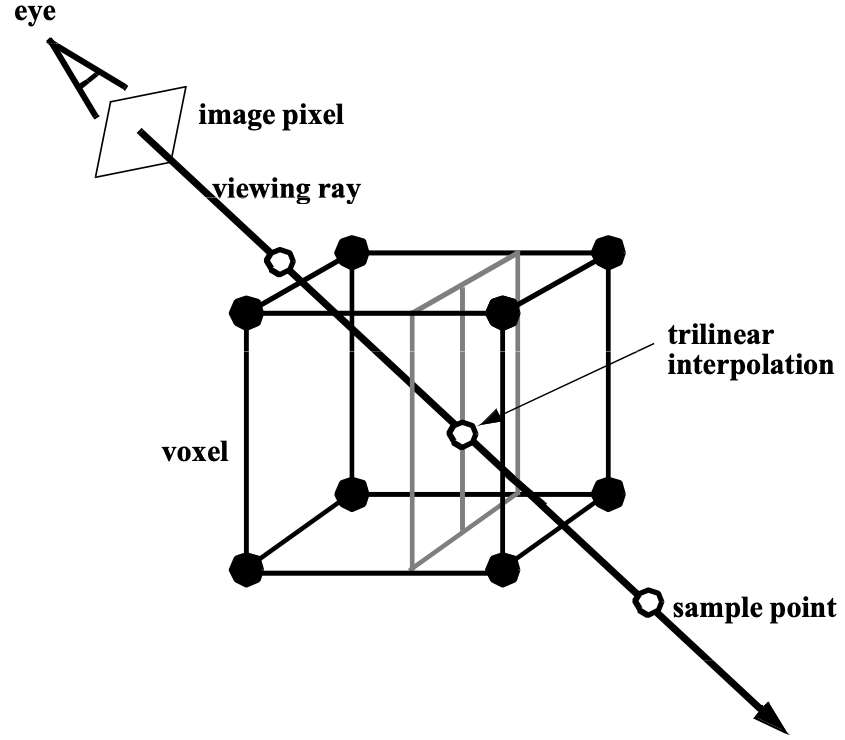

# Unity CTVisualizer

<!--toc:start-->
- [Unity CTVisualizer](#unity-ctvisualizer)
  - [Workflow](#workflow)
  - [Installation](#installation)
  - [Usage](#usage)
  - [Performance Statistics](#performance-statistics)
  - [Limitations](#limitations)
  - [License](#license)
<!--toc:end-->

A Unity3D package for efficiently visualizing and manipulating (mostly)
medical volumetric data.

## Workflow

UnityCT-Visualizer is actually made of two *sub-applications*:

1. Unity Volumetric DataSet (hereafter UVDS) Converter written purely in Python
1. Unity package that deals with visualization code

CT datasets with supported formats are converted using a Python script into a .uvds
format; a very minimal format that we defined and that our C# Unity importer expects.


We decided to use Python for parsing CT (or MRI) dataset formats and converting
them to **UVDS** because:

1. The excellent support certain Python packages (mainly pydicom) provide
for imaging data formats (e.g., DICOM).

1. We believe that using Python for data manipulation tasks is convenient and
very-easily extendable.

1. Datasets are supposed to be converted before runtime then imported to the target
device on which the Unity application will run. This way we can provide the bare
minimum needed for visualizations and that results in smaller datasets and faster
import time on the Unity side.

1. We want to separate code that deals with various dataset formats from code
that deals with visualization tasks.

## Installation

1. For converting volumetric medical datasets, **Python >= 3.10.12** is required.
Latest version of Python can be installed from [here](https://www.python.org/downloads/).
1. Required packages should be installed. Assuming you are in parent repository directory
(where this README exists) and assuming you have a pip installed:

    ```bash
    pip3 install -r uvdsconverter/requirements.txt
    ```

    or (if pip3 didn't work):

    ```bash
    pip install -r uvdsconverter/requirements.txt
    ```

1. For detailed instructions on how to use the converter, you can run the main
CLI script with help option:

    ```bash
    python3 uvdsconverter/uvds.py --help
    ```

    Which should output the following synopsis:

    ```bash
    Usage: uvds.py [OPTIONS] DATASET_DIR_OR_FILE_PATH UVDS_WRITE_FILE_PATH
    ```

1. **Unity = 2022.3.XXXX LTS** has to be installed. We try to keep testing our
package on later Unity versions. The table below describes the versions of
Unity editor which have been tested and their test results.

1. Clone this repository into some folder (currently we don't provided a Unity
package):

    ```bash
    git clone https://github.com/walcht/Unity-CTVisualizer.git
    ```

Tested on these Unity versions:

| Unity Version | OS             | Status | Notes |
|---------------|----------------|--------|-------|
| 2022.3.17f1   | 22.04.1-Ubuntu |:white_check_mark:||
| 2022.3.17f1   | macOS 14.2.1   |:white_check_mark:||

## Usage

## Project Structure

## Optimization Techniques

### Empty space skipping
In this optimization technique, we define volume levels that determine how many cells the volume should be subdivided into. At level zero, we divide the volume into  cells, where . Here,  represents the number of levels, and the levels are indexed from 0 to . On level one, we increase the size of cells so that each cell is equal in size to eight cells from the previous level. On this level, the volume is divided into  cells. We repeat this process for each level until the volume contains only one cell.
<p>
<figure>

<figcaption>1. Hierarchical enumeration of object space for N = 4 cells and M = 3 levels.</figcaption>
</figure>
</p>

We treat voxels as points located on the vertices of cells, each having opacity and color. On level zero, the value of a cell is zero if all eight voxels on its vertices have an opacity of zero. On a higher level `m` (`m > 0`), a cell contains a zero if all eight cells that make up this cell on level `m - 1` contain zeros.

The empty space skipping algorithm starts on the top level . When the ray enters the cell, we check its value. If the value of the cell is zero, we determine the next cell on the same level by following the ray. If the parent of the next cell and the parent of the current cell are different, we move up to the parent of the next cell, otherwise we move to the next cell following the ray. This makes it possible to quickly progress through empty spaces. 
If the the value of a cell is one, we move down one level. When we reach the lowest level, we know that at least one of the voxels located on the vertices of the cell has an opacity value greater than 0. We sample the ray section that falls within this cell. We approximate the color and opacity of each sample point by trilinearly interpolating the color and opacity values of the eight surrounding voxels.
<p>
<figure>

<figcaption>2. Ray tracing of hierarchical enumeration.</figcaption>
</figure>
</p>

<p>
<figure>

<figcaption>3. Trilinear interpolation</figcaption>
</figure>
</p>

### Early ray termination

In early ray termination, sampling along a ray is stopped when the accumulated opacity of the ray reaches a set threshold. This indicates that a sufficiently dense material has been reached, so further sampling doesn't significantly affect the pixel color.

<p>
<figure>

<figcaption>4. Volumetric compositioning</figcaption>
</figure>
</p>

**Image Sources:**

1. Image: [Efficient Ray Tracing of Volume Data - MARC LEVOY](https://www.cs.ucdavis.edu/~ma/ECS177/papers/levoy_raytrace_vol.pdf)
2. Image: [Efficient Ray Tracing of Volume Data - MARC LEVOY](https://www.cs.ucdavis.edu/~ma/ECS177/papers/levoy_raytrace_vol.pdf)
3. Image: [Volume Rendering - Crawfis, Ohio State Univ.](http://web.cse.ohio-state.edu/~parent.1/classes/681/Lectures/VolumeRendering.pdf)
4. Image: [Volume Rendering - Crawfis, Ohio State Univ.](http://web.cse.ohio-state.edu/~parent.1/classes/681/Lectures/VolumeRendering.pdf)


## Performance Statistics

TODO: Add performance statistics for datasets with various sizes and characteristics
here.

## Limitations

## License
